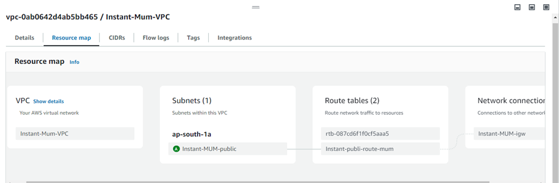

# Devops-Project-Portfolio
This repository describes about all my devops(kubernetes,Docker,AWS,Shell Scripting) projects for referencing.
Project portfolio of Kubernetes, Docker,  AWS (with Terraform)

End To End Kubernetes Project:
Step1:
Creating kubernetes cluster (k3s kubernetes cluster) in Linux machine. I have created single node kube cluster as I have used for development and implementing small projects.
Step2: 
Creating name space in kubernetes for deploying all the resources in the that namespace

Step3
I have created a monitoring namespace as I have deployed all the projects in the default namespace and some of the pods and deployments and services 

Step4:
Im monitoring my Kubernetes cluster using prometheus and Grafana and using Prometheus as data source for the Grafana and I have created several dashbords based on pods, namespaces, cluster health, pod cpu and memory usage.

•	Kubernetes/Views/Namespaces   Dashboard I have created for monitoing of each namespace pods, deployments, services, ingresses.

•	Kubernetes/views/Nodes Dashboard I have created for monitoring my cluster node details like Total RAM, CPU, Internal Memory Usage, Network bandwidth.

•	Kubernetes/Views/Pods Dashboard is used for pod level resource usage and which pod is using more resources and which pods is using less resources etc.

•	Kubernetes Cluster monitoring via Prometheus is used to extract total pod count and running pod heath status and checks and total  namespaces.

•	Kubernetes/Views/Namespaces Dashboard

Kubernetes/Views/Nodes  Dashboard

Kubernetes/Views/Node Exporter Full 

Configuration files for my cluster:

Kubernetes Cluster Logs: 

Terrafrom Project(End to End Project) 
I have deployed multi availability zone tech stack for my webserver this provides high availability and fault tolearant and secure as I have implemented in VPC.
Tech Stack Components:
AWS Account credentials and I have used EC2 instance for installing terraform and I have written terraform code and applied all the necessary configuration essetials for provisiong of my project.

AWS Core Services Used:
VPC  Subnetes   Route Tables   Internet Gateway   LoadBalancer   TargetGroups  EC2 Instances for webserver hosting.
Project  Architecture:

Terrafrom files for infrastrtucture provisioning:

 

I have written terraform code in modules for easier understanding and organizing.

Terrafrom Directory Structue:

VPC(Networking,subnetes,Route Tables, Internet Gateway) Resource Map 

AWS Load Balancer Resource Map( High Level Traffic Flow From ALB To Targets)

Load Balancer DNS Address for target hitting and balances the load between two subnets and instances:

Response From Target1:
When we hit on  alb-mum-web-1786787513.ap-south-1.elb.amazonaws.com  the response from Public-Subnet-1 instance is as follows:

Response From Target2( public-subnet-2)
When we hit on  alb-mum-web-1786787513.ap-south-1.elb.amazonaws.com  the response from target in subnet-2  instance is as follows:

I have highlighted DNS Name and response of webserver-2 as load balancer is distrubuting the traffic to the instance in subnet-1 and instance in subnet-2 effectively.

